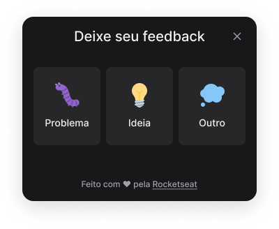

<h1 align="center">
  
</h1>

<p align="center">
 
</p>


## 💻 Projeto
Aplicativo para lhe ajudar a conectar-se e organiza o momento de diversão e jogar com os amigos. Crie grupos para jogar seus games favoritos com seus amigos com esse App que possui autenticação com Discord.

## ✨ Tecnologias

-   [ ] Vite
-   [ ] React
-   [ ] Typescript
-   [ ] Tailwind CSS
-   [ ] HeadlessUI
-   [ ] Phosphor Icons
-   [ ] React Native
-   [ ] Expo
-   [ ] Vector Icons
-   [ ] React Native Svg
-   [ ] Axios
-   [ ] React Native Gesture Handler
-   [ ] NodeJS
-   [ ] Express
-   [ ] Jest


## 🔖 Layout

Você pode visualizar o layout do projeto através [desse link](https://www.figma.com/community/file/1102912516166573468/Feedback-Widget). É necessário ter conta no [Figma](http://figma.com/) para acessá-lo.


## Executando o projeto

Utilize o **yarn** ou o **npm install** para instalar as dependências do projeto.
Em seguida, inicie o projeto.

```cl
Iniciar Back-end

cd server
npm run start || yarn start

Versão Web

cd web
npm run start || yarn start

ou

Versão Mobile

cd mobile
expo start
```

Lembre-se de defir no arquivo .env as configurações da sua aplicação.
 
 ```cl
VITE_API_URL=
```

<br />
